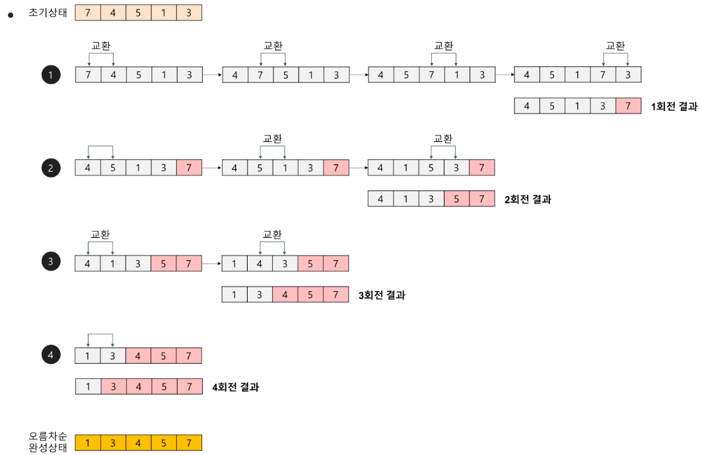

# algorithm


### bubble sort


```java
package arry;

public class arr {
	public static void main(String[] args) {
		int arr[]= {5,4,1,3,2,6};
		int key=0;
		int temp=0;

		for(int i=1; i<arr.length; i++) {
			if(arr[i]<arr[i-1]) {
				temp=arr[i];
				arr[i]=arr[i-1];
				arr[i-1]=temp;
			}
		}


		
		for(int i=0;i<arr.length;i++)
			System.out.print(arr[i]);
	}
}

```
